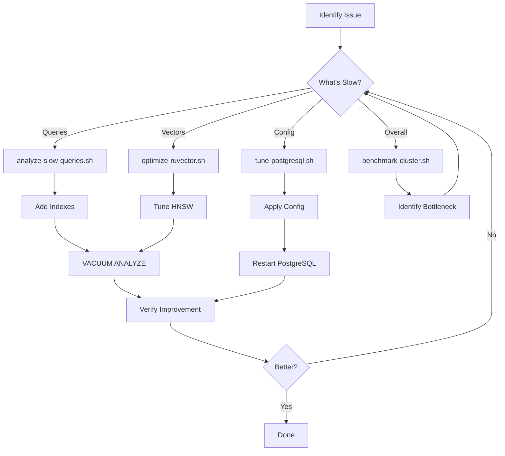

# Performance Optimization Quick Reference

One-page reference for common performance optimization tasks.

## Quick Commands

### 1. Auto-Tune PostgreSQL
```bash
# Auto-detect workload and tune
./scripts/performance/tune-postgresql.sh analyze

# Force specific workload
./scripts/performance/tune-postgresql.sh analyze read-heavy
./scripts/performance/tune-postgresql.sh analyze write-heavy

# Restart to apply changes
docker restart ruvector-db
```

### 2. Analyze Slow Queries
```bash
# Setup (one-time)
./scripts/performance/analyze-slow-queries.sh setup
docker restart ruvector-db

# Generate report
./scripts/performance/analyze-slow-queries.sh report

# Get index recommendations
./scripts/performance/analyze-slow-queries.sh indexes

# Export to CSV
./scripts/performance/analyze-slow-queries.sh export
```

### 3. Optimize RuVector
```bash
# Analyze indexes
./scripts/performance/optimize-ruvector.sh analyze

# Quick benchmark
./scripts/performance/optimize-ruvector.sh quick

# Tune existing indexes
./scripts/performance/optimize-ruvector.sh tune

# Full parameter benchmark
./scripts/performance/optimize-ruvector.sh benchmark
```

### 4. Performance Benchmarking
```bash
# Run and compare with baseline
./scripts/performance/benchmark-cluster.sh run

# Set new baseline
./scripts/performance/benchmark-cluster.sh baseline

# Generate HTML report
./scripts/performance/benchmark-cluster.sh report
```

### 5. Maintenance Operations
```bash
# VACUUM all tables
./scripts/performance/tune-postgresql.sh vacuum

# Analyze index usage
./scripts/performance/tune-postgresql.sh indexes

# Check database health
./scripts/db_health_check.py
```

---

## Performance Targets

| Metric | Target | Warning | Critical |
|--------|--------|---------|----------|
| Query latency (avg) | < 10ms | > 50ms | > 100ms |
| Vector search | < 50ms | > 100ms | > 500ms |
| Cache hit ratio | > 95% | < 90% | < 85% |
| Connection usage | < 50% | > 70% | > 90% |

---

## Common Fixes

### Slow Queries
1. Run: `./scripts/performance/analyze-slow-queries.sh report`
2. Add indexes for sequential scans
3. Run: `ANALYZE table_name;`

### Poor Vector Performance
1. Run: `./scripts/performance/optimize-ruvector.sh analyze`
2. Increase `ef_search`: `SET hnsw.ef_search = 200;`
3. Consider rebuilding indexes with higher `ef_construction`

### Memory Issues
1. Run: `./scripts/performance/tune-postgresql.sh analyze`
2. Increase `shared_buffers` to 25% of RAM
3. Increase `work_mem` for complex queries

### Connection Exhaustion
1. Check usage: `SELECT count(*) FROM pg_stat_activity;`
2. Increase pool size in `src/db/pool.py`
3. Or increase `max_connections` in PostgreSQL

### Table Bloat
1. Run: `./scripts/performance/tune-postgresql.sh vacuum`
2. Check bloat: Look for high `n_dead_tup` ratio
3. Consider `VACUUM FULL` for severe bloat

---

## HNSW Index Parameters

| Scenario | m | ef_construction | ef_search |
|----------|---|-----------------|-----------|
| Development | 16 | 100 | 100 |
| Production | 16 | 200 | 100-200 |
| High Accuracy | 32 | 200 | 200-400 |
| Fast Build | 8 | 50 | 50-100 |

**Create Index:**
```sql
CREATE INDEX CONCURRENTLY idx_embeddings_hnsw ON table_name
USING hnsw (embedding ruvector_cosine_ops)
WITH (m = 16, ef_construction = 200);
```

**Adjust Query Quality:**
```sql
SET hnsw.ef_search = 200;  -- Higher accuracy, slower
SET hnsw.ef_search = 50;   -- Lower accuracy, faster
```

---

## PostgreSQL Configuration by Workload

### Read-Heavy
```sql
ALTER SYSTEM SET random_page_cost = 1.1;
ALTER SYSTEM SET effective_io_concurrency = 200;
ALTER SYSTEM SET work_mem = '64MB';
ALTER SYSTEM SET default_statistics_target = 500;
```

### Write-Heavy
```sql
ALTER SYSTEM SET wal_buffers = '16MB';
ALTER SYSTEM SET checkpoint_completion_target = 0.9;
ALTER SYSTEM SET max_wal_size = '4GB';
ALTER SYSTEM SET random_page_cost = 1.5;
```

### Mixed (Default)
```sql
ALTER SYSTEM SET random_page_cost = 1.3;
ALTER SYSTEM SET effective_io_concurrency = 150;
ALTER SYSTEM SET work_mem = '32MB';
ALTER SYSTEM SET checkpoint_completion_target = 0.7;
```

**Apply Changes:**
```bash
docker exec ruvector-db psql -U dpg_cluster -d distributed_postgres_cluster -c "SELECT pg_reload_conf();"
# Or restart: docker restart ruvector-db
```

---

## Useful SQL Queries

### Find Slow Queries
```sql
SELECT mean_exec_time, calls, query
FROM pg_stat_statements
WHERE mean_exec_time > 100
ORDER BY mean_exec_time DESC
LIMIT 10;
```

### Check Cache Hit Ratio
```sql
SELECT
    ROUND(100.0 * sum(heap_blks_hit) / NULLIF(sum(heap_blks_hit + heap_blks_read), 0), 2) AS cache_hit_ratio
FROM pg_statio_user_tables;
```

### Find Unused Indexes
```sql
SELECT schemaname, tablename, indexname, pg_size_pretty(pg_relation_size(indexrelid)) AS size
FROM pg_stat_user_indexes
WHERE idx_scan = 0 AND indexname NOT LIKE '%_pkey'
ORDER BY pg_relation_size(indexrelid) DESC;
```

### Find Missing Indexes
```sql
SELECT schemaname, tablename, seq_scan, seq_tup_read, idx_scan
FROM pg_stat_user_tables
WHERE seq_scan > 100 AND idx_scan < seq_scan
ORDER BY seq_scan DESC;
```

### Check Table Bloat
```sql
SELECT
    schemaname || '.' || tablename AS table,
    n_live_tup AS live_rows,
    n_dead_tup AS dead_rows,
    ROUND(100.0 * n_dead_tup / NULLIF(n_live_tup + n_dead_tup, 0), 2) AS dead_pct
FROM pg_stat_user_tables
WHERE n_dead_tup > 0
ORDER BY n_dead_tup DESC;
```

### Active Connections
```sql
SELECT count(*), state
FROM pg_stat_activity
WHERE datname = 'distributed_postgres_cluster'
GROUP BY state;
```

### Long-Running Queries
```sql
SELECT pid, now() - query_start AS duration, state, query
FROM pg_stat_activity
WHERE state = 'active' AND query_start < now() - interval '1 minute'
ORDER BY duration DESC;
```

---

## Performance Workflow



---

## Environment Variables

```bash
# Slow query threshold
export MIN_DURATION_MS=100

# Number of results to show
export TOP_N=20

# Benchmark vector count
export BENCHMARK_VECTORS=1000

# Batch size
export BATCH_SIZE=100
```

---

## File Locations

| File | Purpose |
|------|---------|
| `/scripts/performance/tune-postgresql.sh` | Auto-tune PostgreSQL config |
| `/scripts/performance/analyze-slow-queries.sh` | Slow query analysis |
| `/scripts/performance/optimize-ruvector.sh` | RuVector optimization |
| `/scripts/performance/benchmark-cluster.sh` | Performance benchmarking |
| `/docs/PERFORMANCE_TUNING.md` | Comprehensive guide |
| `/tmp/benchmarks/` | Benchmark results |
| `/tmp/postgresql_tuning_report_*.txt` | Tuning reports |
| `/tmp/slow_queries_report_*.txt` | Slow query reports |

---

## Emergency Procedures

### Database Unresponsive
```bash
# 1. Check if container is running
docker ps | grep ruvector-db

# 2. Check logs
docker logs ruvector-db --tail 100

# 3. Kill long queries
docker exec ruvector-db psql -U dpg_cluster -d distributed_postgres_cluster \
  -c "SELECT pg_terminate_backend(pid) FROM pg_stat_activity WHERE state = 'active' AND query_start < now() - interval '5 minutes';"

# 4. Restart if needed
docker restart ruvector-db
```

### Out of Connections
```bash
# 1. Check current connections
docker exec ruvector-db psql -U dpg_cluster -d distributed_postgres_cluster \
  -c "SELECT count(*) FROM pg_stat_activity;"

# 2. Kill idle connections
docker exec ruvector-db psql -U dpg_cluster -d distributed_postgres_cluster \
  -c "SELECT pg_terminate_backend(pid) FROM pg_stat_activity WHERE state = 'idle' AND state_change < now() - interval '10 minutes';"

# 3. Increase max_connections temporarily
docker exec ruvector-db psql -U dpg_cluster -d distributed_postgres_cluster \
  -c "ALTER SYSTEM SET max_connections = 200; SELECT pg_reload_conf();"
```

### Disk Full
```bash
# 1. Check disk usage
df -h /var/lib/docker

# 2. Vacuum to reclaim space
./scripts/performance/tune-postgresql.sh vacuum

# 3. Remove old WAL files (if safe)
docker exec ruvector-db psql -U dpg_cluster -d distributed_postgres_cluster \
  -c "CHECKPOINT;"
```

---

**Quick Help:**
- Full guide: `/docs/PERFORMANCE_TUNING.md`
- Health check: `./scripts/db_health_check.py`
- Database startup: `./scripts/start_database.sh`

**Last Updated:** 2026-02-12
